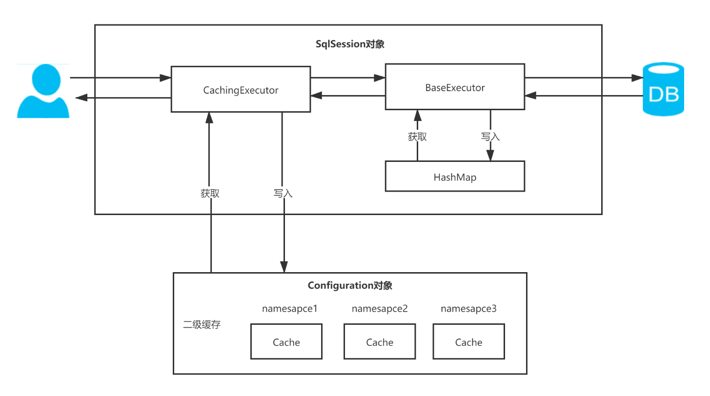
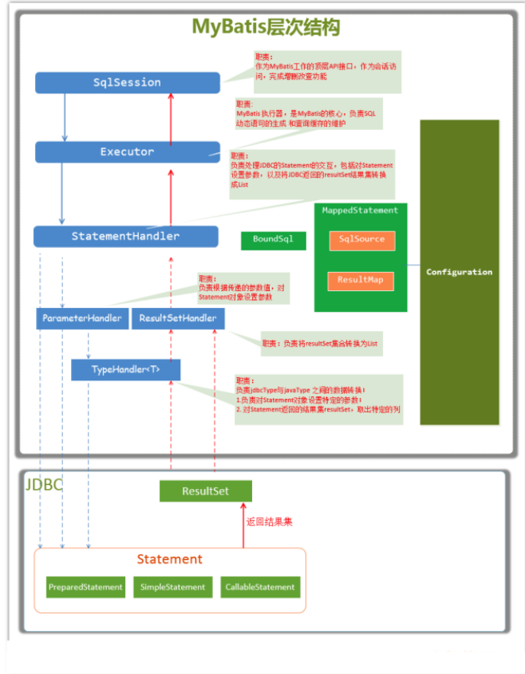

# Mybatis

## 事务管理器

- JDBC：直接使用JDBC的提交和回滚设置，依赖于从数据源得到的连接来管理事务的作用域。
- MANAGED：从不提交和回滚连接，让容器来管理事务的整个生命周期。默认情况下会关闭连接，需要将closeConnection设置为false来阻止默认的关闭行为。

## 数据源（dataSource）

- UNPOOLED：每次被请求时打开和关闭连接。
- POOLED：利用“池”的概念将JDBC连接对象组织起来。
- JNDI：为了能在如EJB或应用服务器这类容器中使用，容器可以集中或在外部配置数据源，然后放置一个JNDI上下文的引用。

## 缓存

Mybatis缓存分为一级缓存和二级缓存，二级缓存默认关闭；

一级缓存基于sqlSession，二级缓存基于Mapper文件的namespace；

缓存的底层数据结构都是HashMap；

二级缓存在分布式环境下会出现脏数据问题；

缓存查询流程图：

​	

## 主要构件

| 构件             | 描述                                                         |
| ---------------- | ------------------------------------------------------------ |
| SqlSession       | 顶层API，表示和数据库交互的会话，完成必要数据库增删查改的功能。 |
| Executor         | 执行器，是Mybatis调度的核心，负责SQL语句的生成和查询缓存的维护。 |
| StatementHandler | 封装了JDBC Statement操作，如设置参数，将Statement结果集转换成List集合。 |
| ParameterHandler | 将用户传递的参数转换成JDBC Statement所需要的参数。           |
| ResultSetHandler | 将JDBC返回的ResultSet结果集对象转换成List类型的集合。        |
| TypeHandler      | 负责Java数据类型和JDBC数据类型之间的映射和转换。             |
| MappedStatement  | 维护一条<select\|update\|delete\|insert>节点的封装。         |
| SqlSource        | 根据用户传递的parameterObject，动态生成Sql语句，将信息封装到BoundSql对象中。 |
| BoundSql         | 表示动态生成的Sql语句以及响应的参数信息。                    |

相互关系：

​	

ErrorContext

Mybatis执行流程

sqlSession.openSession()

sqlSession.getMapper()