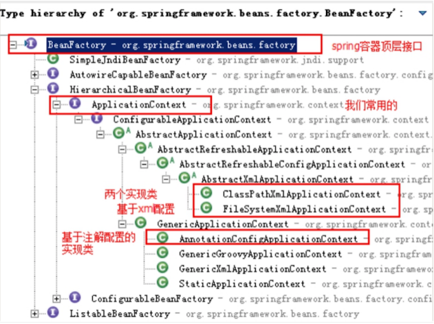

# Spring

## IOC

控制反转，一种技术思想，将对象创建（实例化、管理）的权利交给了外部环境（Spring框架、IOC容器）。解决了对象之间的耦合问题。

与DI（依赖注入）的区别：

描述的是同一件事情，但IOC站在对象的角度，对象实例化和管理的权利交给了容器；DI站在容器的角度，把对象依赖的其他对象注入。

## AOP

面向切面编程，在不改变原有业务逻辑情况下，增强横切逻辑代码，根本上解耦合，避免横切逻辑代码重复。

## BeanFactory与ApplicationContext的区别

BeanFactory是Spring框架中IOC容器的顶层接口，它只是用来定义一些基础功能和基础规范；而ApplicationContext是它的一个子接口，具有BeanFactory的全部功能。

​	

## BeanFactory与FactoryBean

BeanFactory同上；

Spring中Bean有两种，一种是普通Bean，一种是工厂Bean（FactoryBean），FactoryBean可以生成某一个类型的Bean实例，所以可以借助它来自定义Bean的创建过程。

## 三级缓存

## 事务的传播行为

| 行为                      | 解释                                                         |
| ------------------------- | ------------------------------------------------------------ |
| PROPAGATION_REQUIRED      | 如果当前没有事务，就新建一个事务，如果当前有事务，则加入这个事务。 |
| PROPAGATION_SUPPORTS      | 支持当前事务，有事务则加入事务，没有事务则以非事务方式执行。 |
| PROPAGATION_MANDATORY     | 使用当前事务，如果没有事务则抛出异常。                       |
| PROPAGATION_REQUIRES_NEW  | 始终新建事务，如果当前有事务，把当前事务挂起。               |
| PROPAGATION_NOT_SUPPORTED | 以非事务方式执行，如果当前有事务，把当前事务挂起。           |
| PROPAGATION_NEVER         | 以非事务方式执行，如果当前有事务，抛出异常。                 |
| PROPAGATION_NESTED        | 如果当前有事务，则在嵌套事务内执行，如果当前没有事务，则新建一个事务。 |

